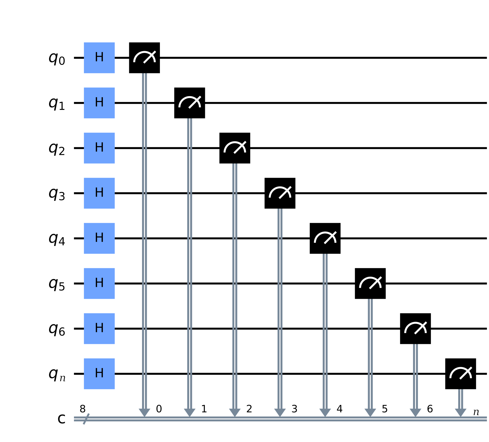

# FastAPI Quantum Random Number Generator (QRNG)

This repository provides a **FastAPI-based API** that generates **quantum random numbers** using Qiskit's quantum circuit simulator.



## Features
- Generates **true quantum-random** numbers (not pseudorandom)
- Supports **variable bit lengths** (8-bit, 16-bit, 256-bit, etc.)
- Allows **range-bound** random numbers (min/max)
- Uses **AerSimulator** for quantum circuit execution
- **Chunked generation** for large bit requests (29 qubits at a time)

### Note:
This project follows **RTFM** (Read The F*cking Manual) and **KISS** (Keep It Simple, Stupid!) principles. Contributions and improvements welcome!

---

## API Endpoints

### **Base Endpoint (`/`)**
Generates a **256-bit quantum random number**  
**Example Response:**
```json
{
  "bits": "101010...0101",
  "as_num": 1234567890,
  "bits_length": 256
}
```

### **Custom Random Number (`/random`)**
Generates quantum random numbers with flexible parameters:
- `length`: Bit length (required)
- `min`: Minimum value (optional)
- `max`: Maximum value (optional)

**Example Usage:**
```bash
curl "http://localhost:8000/random?length=32"
curl "http://localhost:8000/random?length=64&min=100&max=1000"
```

---

##  Installation & Setup

### **Requirements**
- python==3.13
- fastapi==0.115.12
- qiskit==2.0.0
- qiskit-aer==0.17.0
- uvicorn==0.34.2


### **Install Dependencies**
```bash
python3 -m venv .venv
source .venv/bin/activate
pip install -r requirements.txt
```

### **Run the API**
```bash
python3 main.py
```
or
```bash
uvicorn main:app --reload
```
Access the API at: `http://localhost:8000`

---

## How It Works

### **Quantum Circuit Process**
1. Creates quantum circuit with Hadamard gates (puts qubits in superposition)
2. Measures qubits to collapse superposition into 0/1 states
3. Chunks large requests (29 qubits max per circuit)
4. Combines results into final bitstring

### **Range-Bound Generation**
When `min_val` and `max_val` are provided:
1. Calculates required bits for the range
2. Generates numbers until one falls within range
3. Adjusts to fit min/max bounds

---

## Technical Notes

### **Quantum Limitations**
- AerSimulator supports max **29 qubits per circuit**
- Large requests are automatically chunked
- True quantum randomness (not pseudorandom)

### **Performance Considerations**
- Each circuit execution takes ~50-100ms
- Range-bound numbers may require multiple attempts
- Consider caching for high-frequency requests

---

## License  
MIT/X Consortium License © 2025 [mahmoudElshimi](mailto:mahmoudelshimi@protonmail.ch)  
